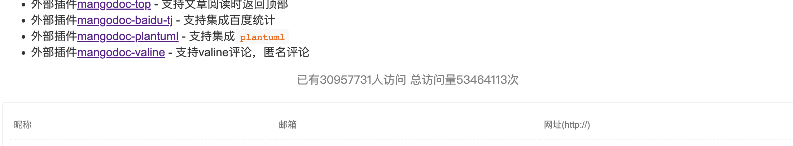

# mangodoc-busuanzi
mangodoc busuanzi plugin for show visit，集成[busuanzi](https://busuanzi.ibruce.info/)插件，显示网站访问量情况！

[](https://www.npmjs.com/package/mangodoc-busuanzi)




## Usage
1. Configure mangodoc-busuanzi:(配置 ）

    ```html
    <script>
    window.$mangodoc = {
      // 开启busuanzi
      busuanzi: true,
    </script>
    ```

2. Insert script into mangodoc document:

    ```html
    <script src="https://unpkg.com/mangodoc-busuanzi@1.1.0/dist/mangodoc-busuanzi.min.js"></script>
    ```
